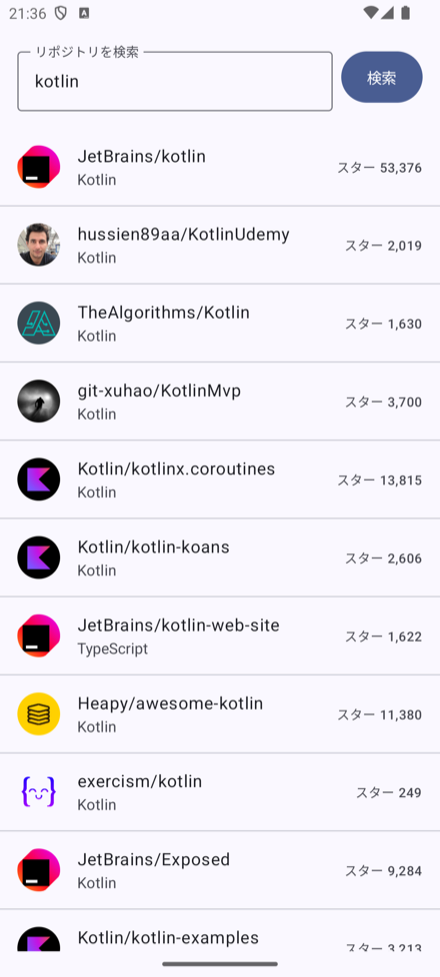
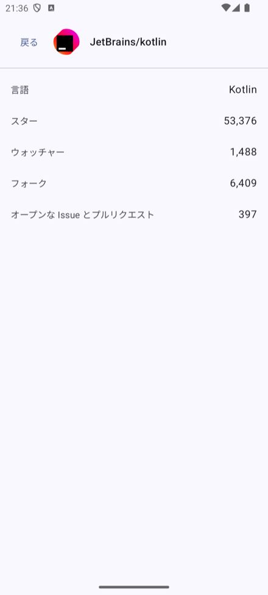
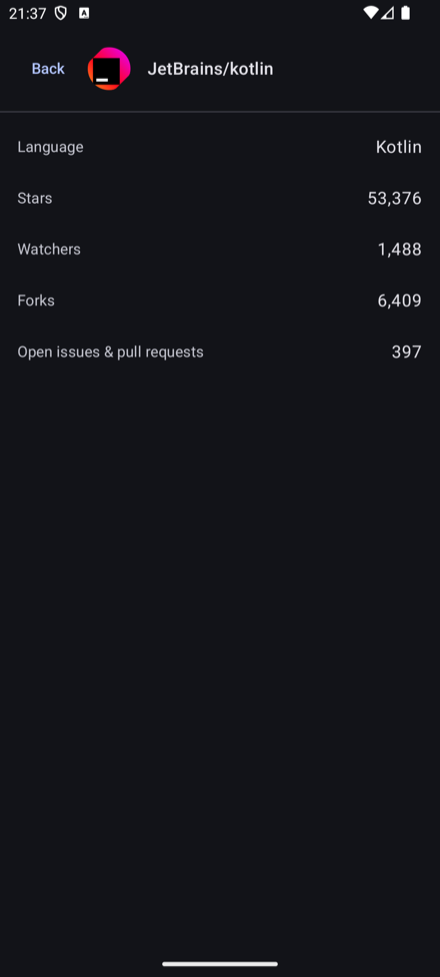
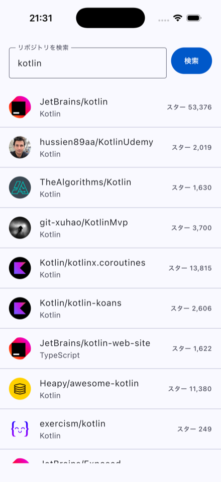
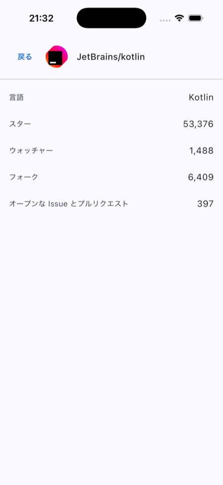
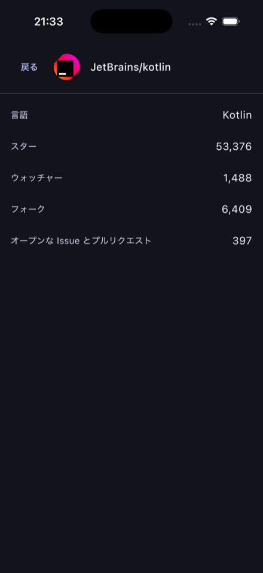
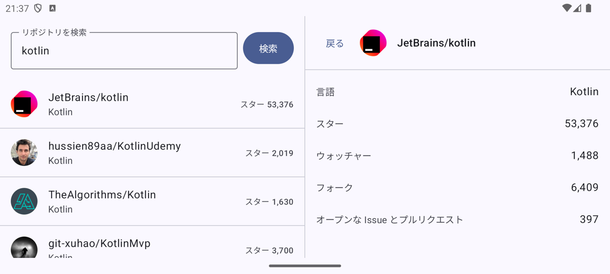
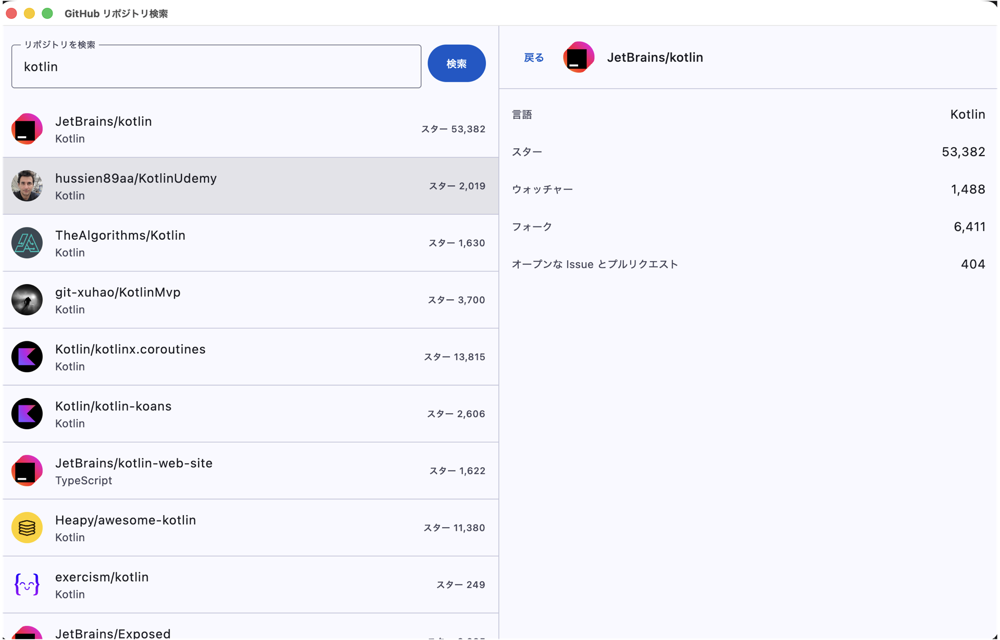
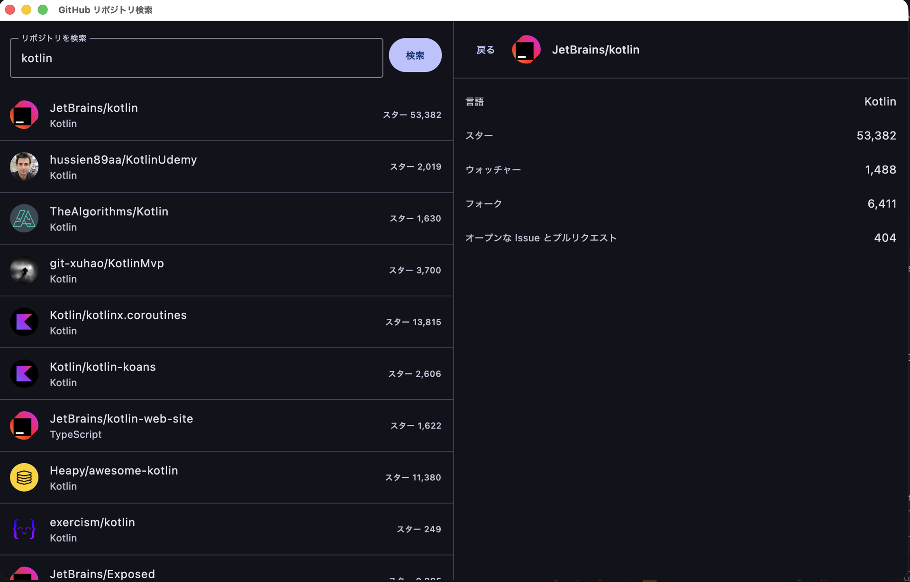

# GitHub リポジトリ検索 — Kotlin Multiplatform

キーワードで GitHub のリポジトリを検索し、詳細を表示する **Android / iOS / Desktop** の 3
プラットフォーム対応アプリです。UI を含むほぼ全てのコードを Kotlin Multiplatform +
Compose Multiplatform で共有しています。

アプリコード（`build-logic` を除く `.kt` / `.swift`）10,121 行のうち **96.6% が共有ソースセット**に
あります。プラットフォーム固有なのは合計 340 行だけで、その内訳は 3 つのエントリポイントと、
本当にプラットフォームが違う 4 組の `expect`/`actual`（ディスパッチャ、ダイナミックカラー、
reduce-motion、数値フォーマット）、そして Swift 62 行です。

---

## 目次

- [スクリーンショット](#スクリーンショット)
- [課題要件との対応](#課題要件との対応)
- [インストール — 配布ビルドを試す](#インストール--配布ビルドを試す)
- [セットアップと実行](#セットアップと実行)
- [アーキテクチャ](#アーキテクチャ)
- [GitHub API の 3 つの罠](#github-api-の-3-つの罠)
- [テスト戦略 — TDD](#テスト戦略--tdd)
- [CI / CD](#ci--cd)
- [Build Variant](#build-variant)
- [セキュリティ](#セキュリティ)
- [UI/UX](#uiux)
- [バージョン選定と、最新安定版を採らなかった理由](#バージョン選定と最新安定版を採らなかった理由)
- [アーキテクチャ決定記録（ADR）](#アーキテクチャ決定記録adr)
- [Git 運用](#git-運用)
- [トレードオフと既知の制約](#トレードオフと既知の制約)
- [アピールポイント](#アピールポイント)
- [AI の利用について](#ai-の利用について)

---

## スクリーンショット

| Android — 検索結果 | Android — 詳細（7 項目） | Android — ダークモード + 英語 |
|:---:|:---:|:---:|
|  |  |  |

| iOS — 検索結果 | iOS — 詳細 | iOS — ダークモード |
|:---:|:---:|:---:|
|  |  |  |

**画面回転 → 二画面（list-detail）レイアウト。** 回転をまたいで検索結果も選択中のリポジトリも保持されます。



**Desktop（macOS）— 二画面レイアウトと、システム設定に追従するテーマ。** ウィンドウ幅を広げると
Android の回転と同じ `WindowSizeClass` の判定で list-detail になります。タイトルバーの
「GitHub リポジトリ検索」も `:core:designsystem` の同じ文字列バンドルから来ています。

| Desktop — ライト | Desktop — ダーク |
|:---:|:---:|
|  |  |

> 詳細画面の「スター 53,376」と「ウォッチャー 1,488」は **別の数字** です。GitHub の
> `watchers_count` は star のエイリアスであり、両方をそこから読むと全リポジトリで同じ数字が
> 並びます。本アプリは `subscribers_count` を使用しています。
> 詳細は [GitHub API の 3 つの罠](#github-api-の-3-つの罠)。

---

## 課題要件との対応

| 課題の「動作」要件 | 実装 |
|---|---|
| 何かしらのキーワードを入力できる | `SearchContent` のテキストフィールド |
| 入力したキーワードで GitHub のリポジトリを検索できる | 明示的な submit（IME の検索アクション / 検索ボタン）で発火 |
| `search/repositories` を利用する | `:data:github` の `GithubRepository` |
| 検索結果は一覧で概要（リポジトリ名）を表示する | `LazyColumn`。名前に加えて言語と star を補助情報として表示 |
| タップしたら詳細（7 項目）を表示する | リポジトリ名 / オーナーアイコン / 言語 / Star / Watcher / Fork / Issue の 7 項目。`GET /repos/{owner}/{repo}` から**すべて**取得 |

**対応プラットフォーム**（課題は 2 つ以上、うち Android か iOS を必須と規定）

| | 最低バージョン | 確認環境 |
|---|---|---|
| Android | `minSdk 26`（Android 8.0） | エミュレータ Android 16（API 36） |
| iOS | 16.6 | シミュレータ iOS 26.5（iPhone 17 Pro） |
| Desktop | JVM 21（macOS / Windows / Linux） | macOS |

UI は 3 プラットフォームで Compose Multiplatform を共有しており、プラットフォーム別の画面実装はありません。

---

## インストール — 配布ビルドを試す

**最新リリース: [v1.0.0](https://github.com/nicolaselliot/accenture-coding-test/releases/tag/v1.0.0)**
— 3 プラットフォーム分の成果物が揃っています。

| 成果物 | サイズ | 入手先 |
|---|---:|---|
| `androidApp-prod-release.apk` | 1.8 MB | GitHub Releases / Firebase App Distribution |
| `GitHubSearch-1.0.0.msi`（Windows） | 66 MB | GitHub Releases |
| `GitHubSearch-1.0.0.dmg`（macOS） | 76 MB | GitHub Releases |
| `.ipa`（iOS, ad-hoc） | — | Firebase App Distribution のみ（下記の理由により Release には置きません） |

Firebase へのアップロードは完了しています。テスターの参加経路は次節のとおりです。
GitHub Releases への公開は `v*.*.*` タグのときだけです。テスターへの配布はそれに加えて、
`release.yml` を手動起動（`workflow_dispatch`）したときにも行われます。いずれにしても
プルリクエストでは決して動きません。

配布先はプラットフォームごとに分けています。モバイル 2 つは **Firebase App Distribution**、
Desktop は **GitHub Releases** です。モバイル配信サービスはデスクトップのインストーラを
ホストせず、ストアのトラックはこの課題の「仮の」デプロイ環境には前提が重すぎるためです
（[ADR-0013](docs/adr/0013-distribute-from-a-separate-tag-triggered-workflow.md)）。

### Firebase の招待リンクについて

Firebase App Distribution の**招待リンク**を発行済みです。メールでの個別招待を必要とせず、
リンクからの参加でテスターとして登録されます。

**招待リンクは本 README に記載せず、レビュアーへ個別に送付します。** 公開リポジトリに掲載した
場合、リンクを取得した第三者が署名済みビルドを入手できるためです。

Android は下記 **B** の経路であれば招待リンクなしで動作を確認できます。iOS は招待リンクからの
参加が前提で、インストールにはさらに端末の UDID 登録が必要です（後述）。

### Android — 2 通り。B はリンクなしで試せます

**A. Firebase App Distribution（招待リンク経由・推奨）**

1. 招待リンクを **Android 端末で** 開き、Google アカウントで参加します。
2. 案内に従って **App Tester** アプリをインストールします。
3. App Tester から最新ビルドをインストールします。

以降の配布は App Tester に通知が届くため、次のリリースも同じ場所から入れられます。

**B. GitHub Releases からサイドロード（リンク・アカウント不要・最短）**

1. Releases から **`androidApp-prod-release.apk`**（1.8 MB）をダウンロードします。
2. 端末で「提供元不明のアプリ」のインストールを許可します
   （設定 → アプリ → 特別なアプリアクセス → 不明なアプリのインストール）。
3. APK を開いてインストールします。

**どちらを選んでも中身は同一のビルドです** — 1 回の Gradle 実行で生成した 1 つの APK を
2 か所へ送っています。A は更新通知が付き、B は招待リンクも Google アカウントも
App Tester の導入も要りません。**B が Release に置いてあるのはこのためです**:
招待を受けていない方でも、このリポジトリだけで動くものを確認できます。

### iOS — 招待リンクから参加できますが、UDID の登録が 1 手必要です

**iOS はレビュアー側の操作だけでは完結しません。** ad-hoc 署名のため、プロビジョニング
プロファイルに UDID が含まれる端末にしかインストールできません。これは配布サービスの制約では
なく、Apple の署名の仕組みによるものです。

1. 招待リンクを **対象の iPhone の Safari で** 開き、参加します。
2. 案内に従って App Tester を入れ、インストールを試みます。ここで端末の UDID が
   Firebase 側に登録されます。
3. **ここで手順が一旦止まります。** リポジトリ側で UDID を Apple のポータルに登録し、
   プロファイルを再生成して、リリースを再実行する必要があります。プロファイルは署名時に
   `.ipa` へ焼き込まれるため、**新しいビルドの再配布が必須**です。所要は数分ですが手作業です。
4. 再配布の通知が届いたら、App Tester からインストールできます。

iOS での確認を希望する場合は、その旨の連絡が必要です。UDID が Firebase に登録された時点で
プロファイルを更新し、再配布します。

TestFlight に替えてもこの制約は消えません。App Store Connect のレコード、API キー、
メタデータ、Beta App Review が増えるだけで、**どちらの経路でも「事前登録なしのレビュアーが
iOS 端末に入れる」ことはできません。** この制約が両経路に共通であることを前提に、モバイル 2
プラットフォームを 1 つのチャネル、1 つのサービスアカウント、1 つのテスターグループに統合して
います。

### Windows — GitHub Releases の `.msi`

1. Releases から **`GitHubSearch-1.0.0.msi`**（66 MB）をダウンロードします。
   ファイル名の版はタグから `v` を除いたものです。
2. 実行すると **SmartScreen が警告を表示します。** インストーラに署名していないためです。
   「詳細情報」→「実行」で続行します。
3. インストール後、スタートメニューの **GitHubSearch** から起動します。

`.msi` は Windows ランナーで生成しています。jpackage は自分が動いているホストの
インストーラしか作れないためで、WiX 3 の存在はワークフローが事前に検査します。

### macOS — GitHub Releases の `.dmg`

1. Releases から **`GitHubSearch-1.0.0.dmg`**（76 MB）をダウンロードして開き、
   アプリケーションフォルダにコピーします。
2. 初回起動は **Gatekeeper に拒否されます。** アプリを右クリック →「開く」→「開く」、
   または システム設定 → プライバシーとセキュリティ →「このまま開く」で続行します。

署名・公証していない理由は、公証に *Developer ID Application* 証明書が要るためです。
iOS の ad-hoc 署名に使う *Apple Distribution* 証明書とは別物で、このプロジェクトの他のどこでも
必要にならない 2 つ目の認証情報になります。

### インストールされるのは prod ビルドです

配布されるのはすべて `prod` フレーバーで、トークンを一切埋め込まず、ログを一切出しません
（生成器が構造的にそう保証します — [Build Variant](#build-variant)）。開発版と識別子が
分かれているため、開発ビルドと並べてインストールできます。

---

## セットアップと実行

ソースからビルドして実行する場合の手順です。ビルド済みの成果物を導入するだけの場合は、
[インストール — 配布ビルドを試す](#インストール--配布ビルドを試す) を参照。

### 前提

| | バージョン |
|---|---|
| JDK | 21（`foojay-resolver` が未導入の環境にも解決します） |
| Android SDK | `android-37.0` |
| Xcode | 26.6（iOS のみ） |

Gradle は Wrapper が同梱されており、`distributionSha256Sum` で配布物を固定しています。

### Android

```bash
./gradlew :androidApp:installDevDebug
```

### Desktop

```bash
./gradlew :desktopApp:run
```

インストーラ（`.dmg` / `.msi` / `.deb`）は `:desktopApp:packageDistributionForCurrentOS` で作成します。
Compose の Gradle プラグインは Homebrew 版 JDK でのパッケージングを拒否する（`checkJdkVendor`）ため、
配布物は CI のランナーで生成しています。

### iOS

```bash
open iosApp/iosApp.xcodeproj    # scheme: iosApp を実行
```

Xcode の Run Script フェーズが `:shared:embedAndSignAppleFrameworkForXcode` と
`:shared:syncComposeResourcesForIos` を呼び出すため、Gradle 側の事前実行は不要です。

### GitHub Personal Access Token（任意）

**トークンなしで全機能が動作します。** 設定するとレート制限が緩和されます（検索 10 → 30 回/分）。

```bash
# 環境変数、または gitignore 済みの local.properties に
export GITHUBSEARCH_GITHUB_TOKEN=ghp_xxxxxxxx
```

`GITHUB_TOKEN` ではなく `GITHUBSEARCH_GITHUB_TOKEN` である点は意図的です。前者は `gh` CLI と
GitHub Actions が全ジョブに注入する名前であり、そちらを読むと**リリースビルドに周囲の PAT が
埋め込まれてしまいます**。なお `prod` フレーバーはトークンを構造的に破棄します（後述）。

### 検証コマンド

```bash
./gradlew ktlintCheck detekt checkBuildLogic     # フォーマット + 静的解析 + build-logic 自身のテスト
./gradlew build                                  # 全ターゲットのビルドと 264 件の共有テスト
./gradlew testAndroidHostTest                    # Android ホスト JVM で 222 件
./gradlew :androidApp:assembleProdRelease -Pgithubsearch.flavor=prod
```

---

## アーキテクチャ

### レイヤリング

依存の向きは一方通行です。

```text
UI (Composable) → ViewModel → UseCase → Port (interface) ← Repository → Ktor
```

- `:domain` は `:core:common` のみに依存します。Ktor も Compose も DTO も `androidx` も
  import しません。
- Port インターフェースは `:domain`、実装は `:data:github`、束ねるのは `:shared` だけです。
  両側を知っているモジュールは `:shared` ひとつです。
- DTO は `:data:github` の外に出ません。境界のマッパーが腐敗防止層として働き、
  ここで null 許容性と API の癖を正規化します。

### モジュール構成

JetBrains が 2026 年に推奨する KMP 構成に従い、**アプリのエントリポイントを独立モジュール**とし、
共有コードと混ぜていません。

```text
androidApp/          Android のエントリポイント
desktopApp/          Desktop (JVM) のエントリポイント
iosApp/              Xcode プロジェクト（Gradle モジュールではない）
shared/              アプリの合成: DI グラフ、ナビゲーション、ルートコンポーザブル
core/common/         Outcome, AppError, DispatcherProvider, expect/actual
core/designsystem/   テーマ、トークン、共有コンポーザブル、文字列リソース
core/network/        Ktor クライアント、認証、レート制限ヘッダの解釈
core/testing/        フェイク、フィクスチャ、テスト用ディスパッチャ（テスト専用リーフ）
domain/              エンティティ、Port、ユースケース
data/github/         DTO、マッパー、リポジトリ実装
feature/search/      SearchScreen + SearchViewModel
feature/detail/      DetailScreen + DetailViewModel
build-logic/         規約プラグイン（included build）
```

Gradle モジュール **11 個**、加えて `build-logic` が included build、`iosApp` が Xcode プロジェクトです。
2 画面のアプリを過剰にモジュール分割しないよう、この構成から増やしていません。

`:core:testing` は**テスト専用リーフ**です。`*Test` ソースセットからのみ依存でき、`*Main` からは
依存できません。プロダクションコードがそこの何かを必要とするなら、それは置き場所を間違えています。

### DI — Koin

Hilt / Dagger は JVM + Android 専用で `commonMain` にも iOS にも注入できないため、Koin 4.2.2 を使います。

- **コンストラクタインジェクションのみ。** クラス内部でのサービスロケータ参照はしません。
- ViewModel は `koin-compose-viewmodel` 経由。
- **ディスパッチャは常に注入します。** `Dispatchers.IO` を直接参照すると `TestDispatcher` に
  差し替えられず、`runTest` が仮想時間の制御を失います。
- グラフは `checkModules()` でテストしており、束ね忘れは実機ではなく CI で落ちます。

HTTP クライアントは **2 つ**あり、これは意図的です。API 用クライアントは全リクエストに
`Authorization` ヘッダを付けますが、アバターの URL は `avatars.githubusercontent.com` という
**別ホスト**を指します。同じクライアントを Coil に渡すと、アバター URL が名指しした任意のホストへ
利用者の PAT が送られます。オブジェクトを 1 つ節約する代わりに認証情報を漏らす取引はしません。

### 並行処理

- 状態は `StateFlow`、単発イベントは `SharedFlow`。ナビゲーションを状態としてモデル化しません
  （回転で再発火します）。
- `GlobalScope` は使いません。ViewModel の処理は `viewModelScope`。
- `CancellationException` は握り潰さず、`AppError` にもマップしません。利用者が既に離れた画面に
  エラーを出すことになるためです。
- Desktop には `kotlinx-coroutines-swing` を入れています。無いと `Dispatchers.Main` が初回使用時に
  `IllegalStateException` を投げ、初回起動でクラッシュします。

### エラーハンドリング

`:core:common` の 1 つの sealed 階層に集約し、UI 層でローカライズ済みメッセージに変換します。

```kotlin
public sealed interface AppError {
    public data object Network : AppError
    public data class RateLimited(val resetAt: Instant) : AppError
    public data object NotFound : AppError
    public data object Unauthorized : AppError
    public data class Serialization(val cause: String) : AppError
    public data class Unknown(val cause: String) : AppError
}
```

結果型は `Outcome<T>` です。`Result` という名前は `commonMain` で `kotlin.Result` を
静かに shadow するため使いません。

各画面は **loading / empty / error / content** を別々の状態としてモデル化しています。
特に **empty と error の区別**は重要で、「何もヒットしなかった」検索と「壊れた」検索は
見た目が同じであってはならず、リトライが付くのは後者だけです。

**レート制限のときは待ち時間を分で提示します。** `RateLimited` が運ぶのは実際の `Instant` なので、
ViewModel が注入された `Clock` に対して残り時間を分（切り上げ、最低 1 分）に解決し、画面はその数字を
表示します。「しばらく待ってください」では 1 分の待ちと 1 時間の待ちが同じ文面になり、詳細画面の
予算は 1 時間あたり 60 回なので後者が現実に起こります。切り上げるのは、切り捨てると利用者を早く
呼び戻して同じ失敗にもう 1 リクエスト使わせるためです。計算は `:core:common` の
`rateLimitWaitMinutes` 1 箇所にあり、2 画面で規則がずれません。

失敗の翻訳は Ktor の `HttpResponseValidator` 1 箇所に集約しており、リポジトリ側に
散らばった `try/catch` はありません。

### Kotlin の言語機能とコード品質

- **値クラス** — `RepositoryId`、`SearchRequestId`。star 数やページ番号を渡せてしまう
  `Long` / `Int` の引数を型で塞いでいます。防いでいる間違いは、そうしなければ完全にコンパイルが通ります。
- **sealed interface** — `AppError`、`SearchPhase`、`Outcome`。`when` が `else` なしで網羅になります。
  ドメインの `when` に `else` を書くと、次に追加したバリアントを静かに飲み込みます。
- **プロダクションコードに `!!` も無検査キャストも空の `catch` もありません。**
  null 許容性はマッパーの境界で処理し、UI 層に到達させません（`build-logic` のテストに
  例外メッセージを検査する `!!` が 3 箇所あるのみです）。
- **`expect`/`actual` は本当にプラットフォームが違うところだけ** — ディスパッチャ、
  ダイナミックカラー、reduce-motion、数値フォーマット。それ以外はインターフェースと Koin です。
- **型安全なルート** — `@Serializable` な `NavKey` 実装。文字列ルートはありません。
- **コメントは what ではなく why を書いています。** 公開宣言には KDoc を付け、ライブラリモジュールは
  Explicit API mode `strict` なので、公開面は意図の結果であって偶然ではありません。
  `RepositoryCoordinates` のバリデーションや `GithubHttpClient` のプラグイン順序のコメントは、
  「何をしているか」ではなく「なぜそうしないと壊れるか」を書いた例です。

---

## GitHub API の 3 つの罠

このアプリの設計判断のうち 3 つは、GitHub API の仕様に直接由来しています。

### 1. `watchers_count` は watcher ではなく star

`watchers_count` は star が watch と呼ばれていた時代の凍結されたエイリアスで、検索エンドポイントでも
リポジトリエンドポイントでも `stargazers_count` と同じ値を返します。課題は Star 数と Watcher 数を
**別々の項目**として要求しているため、両方を素直にバインドすると全リポジトリで同じ数字が並びます。

本当の watcher 数は **`subscribers_count`** で、これは `GET /repos/{owner}/{repo}` にしかありません。
そのためタップ時に取得しています。上のスクリーンショット（53,376 と 1,488）が、実際に別の値を
表示していることの証拠です。

また `open_issues_count` は**プルリクエストを含みます**。ラベルを「オープンな Issue とプルリクエスト」
としているのはそのためで、「Issue 数」と書くと PR のあるリポジトリでは静かに誤った表示になります。

### 2. レート制限が非対称で、しかも低い

| API | 未認証 | PAT あり |
|---|---|---|
| `search/repositories` | 10 回 / **分** | 30 回 / 分 |
| `GET /repos/{owner}/{repo}` | 60 回 / **時** | 5,000 回 / 時 |

**レビュアーは PAT なしで動かすため、10 回/分が実際の予算です。** これが検索のトリガーを決めました。

- **検索は明示的な submit で発火します** — IME の検索アクション、または検索ボタン。1 打鍵ごとではありません。
  課題はキーワードが「入力できる」ことと「検索できる」ことを求めており、インクリメンタルサーチは
  求めていません。1 単語打つのに 10 回中 6 回を使い切ると、レート制限のエラー状態が例外ではなく
  既定の体験になります。
- 最小クエリ長 2 文字、二重タップ合体用のデバウンス 800ms（インクリメンタル検索のタイマーではありません）。

レート制限のシグナルは **2 種類**あり、両方扱っています。

- **一次制限** — 403 または **429** で `x-ratelimit-remaining: 0`。リセット時刻は
  `x-ratelimit-reset`（unix 秒）。
- **二次制限** — 403 または 429 で **`retry-after`**（差分秒）があり、`x-ratelimit-reset` は
  役に立たない。注入した `Clock` に対して換算します。

ヘッダが欠けている・空・数値でない場合は汎用エラーに縮退します。クラッシュも、過去の `Instant` の
生成もしません。**数値ではあるが信じられない値**（GitHub のどの予算よりも先＝1 時間超）も同じ扱いで、
分数なしの文面に縮退します。画面が勝手に数字を作るより、具体的なことを言わない方がましだからです。

ページングは検索結果 1,000 件で頭打ちになり、`page × per_page > 1000` のリクエストは 422 で
拒否されます。`per_page = 30` から最終ページ **33** を計算しており、数値をハードコードしていません
（到達可能な上限は 990 件で、1,000 ではありません）。

### 3. 検索インデックスはリポジトリ実体より遅れる

`search/repositories` はキャッシュされたインデックスを返すため、その `stargazers_count` /
`forks_count` / `open_issues_count` は `GET /repos/{owner}/{repo}` より古いことがあります。

そのため詳細画面のモデルは**すべて詳細レスポンスから**構築しています。検索時の数値を、
取得したての `subscribers_count` の隣に並べません。並べると 1 つの画面に 2 つの時点の真実が
表示されます。これはナビゲーションのルート設計にも現れていて、詳細画面のルートキーは
`DetailKey(owner, name)` という**識別子だけ**を運び、`RepositorySummary` を運びません。

---

## テスト戦略 — TDD

**TDD がこのプロジェクトの作業方法であり、後付けではありません。** プロダクションコードは
失敗するテストへの応答として書かれています。

Kent Beck の Canon TDD に従い、各 PR ではまずテストシナリオの一覧を書き、そこから 1 項目ずつ
具体的な失敗するテストに変え、通し、リファクタする、という循環を回しています。1 コミットが
1 つの green なサイクルです。

### 規模

| | 件数 | 実行される場所 |
|---|---:|---|
| ユニットテスト（共有） | 222 | Desktop / iOS シミュレータ / Android ホスト JVM |
| UI テスト（`runComposeUiTest`） | 42 | Desktop / iOS シミュレータ |
| build-logic 自身のテスト | 15 | JVM |
| **合計** | **279** | すべて毎 PR の CI 内 |

### テストダブルは Fake が既定

Meszaros の 5 分類のうち、**Fake を既定**にしています。KMP では好みの問題ではありません
— 手書きの Fake はコード生成なしに全ターゲットで動き、デバッグしやすく、呼び出し順序に
テストを結合させません。モッキングフレームワークは Native で不安定です。共有 Fake は
`:core:testing` にあります。

モックを使うのは**相互作用そのものが仕様である**場合だけです。

### 時刻とディスパッチャ

`Clock` は注入し、プロダクションコードで `Clock.System.now()` を呼びません。レート制限の
リセット時刻は時刻依存の振る舞いであり、偽装できない時刻依存の振る舞いは flaky なテストを生みます。
`kotlin.time.Instant` / `kotlin.time.Clock`（標準ライブラリ）を使い、kotlinx-datetime は入れていません。

Flow のアサーションは必ず Turbine を使い、手書きのコレクションはしません。

### UI テストの構成

`runComposeUiTest` の中では **Koin を初期化できません**（CMP の UI テストは Android のテスト
ランナーを使わず `Application` を構築しないため）。したがって UI テストは**ステートレスな
コンテンツ**（`SearchContent` / `DetailContent`）を対象とし、素の state オブジェクトと
ラムダのスパイで駆動します。配線を持つ `SearchScreen` 側は ViewModel のユニットテストと
`checkModules()` が担保します。これは代替手段ではなく主たる経路であり、
ステートフル / ステートレス分割を必須にしている理由でもあります。

スイートは `commonTest` ではなく **`uiTest` ソースセット**に置いています。`commonTest` は
Android のホスト JVM にも供給され、そこでは CMP の UI テストが Robolectric のフィンガープリント
判定で落ちるためです。**Android の device test レグはありません** — 理由は
[ADR-0012](docs/adr/0012-run-the-ui-suite-on-desktop-and-ios.md) に記録しています。
CI に AVD は一つも要りません。

---

## CI / CD

### `ci.yml` — 毎 PR

| ジョブ | 内容 |
|---|---|
| `validate-wrapper` | `gradle-wrapper.jar` 自体を検証。他の全ジョブがこれに依存します |
| `lint` | `ktlintCheck` + `detekt` + `checkBuildLogic`（ホスト非依存なので 1 回だけ） |
| `build` (ubuntu / macos / windows) | `./gradlew build` — Android APK、Android Lint、Desktop、macOS では iOS klib と**シミュレータ UI スイート**まで |
| build（ubuntu 追加） | `:androidApp:assembleProdRelease` + `verifyProdReleaseComposeResources` — 実際に配布されるバリアント |
| build（macos 追加） | `xcodebuild` によるシミュレータ向けビルド — Gradle レグは Xcode プロジェクトを一度も開かないため |

third-party の GitHub Actions は**すべてコミット SHA で固定**しています
（[ADR-0005](docs/adr/0005-pin-github-actions-by-commit-sha.md)）。各アクションはこのリポジトリの
認証情報を持つジョブの中で任意のコードを実行するため、依存関係と同じ扱いをしています。
`persist-credentials: false` により、必要のないジョブに Git のトークンを残しません。

### AI レビュー

**CodeRabbit** を全 PR で動かしています。コミット済みの `.coderabbit.yaml` の `path_instructions` が
このプロジェクトの規約を反映しているため、汎用的な Kotlin の助言ではなく、**このプロジェクトで
問題になる欠陥**をレビューします — レイヤリング違反、握り潰された `CancellationException`、
`subscribers_count` ではなく `watchers_count` にバインドされた詳細画面。
公開リポジトリでは無料で、シークレットを必要としません（[ADR-0006](docs/adr/0006-use-coderabbit-for-ai-review.md)）。
必須ステータスチェックには含めていません — サービス側のレート制限（1 時間あたり 1 レビュー、
無料枠）にかかるとその回は完了しないためで、レビューは実施ベスト・エフォート、非ブロッキングです。

### `release.yml` — 仮のデプロイ環境

`v*.*.*` タグ、または手動 dispatch でのみ起動します。**プルリクエストでは決して動きません** —
これがフォークからシークレットへ手が届かない理由です。

| プラットフォーム | 成果物 | 配布先 |
|---|---|---|
| Android | 署名済み `.apk` | Firebase App Distribution + GitHub Release |
| iOS | ad-hoc 署名の `.ipa` | Firebase App Distribution |
| Desktop | `.dmg`（macOS ランナー）/ `.msi`（Windows ランナー） | GitHub Release |

4 つの成果物ジョブ（Android / iOS / Desktop `.dmg` / Desktop `.msi`）はいずれも CI で
green を確認済みです。iOS のレグは、アーカイブ、手動署名、`release-testing` でのエクスポート、
Firebase へのアップロードまでを含めて通っています。

受け取る側の手順は [インストール — 配布ビルドを試す](#インストール--配布ビルドを試す) にあります。

ストアのトラックは使いません。Play の internal testing は初回リリースの手動アップロード、
App content の申告、サイドロードできない `.aab` を要求し、TestFlight は App Store Connect の
レコード、API キー、メタデータ、Beta App Review を要求します。「仮の」デプロイ環境に対して
どちらも前提が重すぎます（[ADR-0013](docs/adr/0013-distribute-from-a-separate-tag-triggered-workflow.md)）。

`versionCode` / iOS のビルド番号は `github.run_number` から採ります。テスターは既にインストール済みの
ビルドに上書きインストールするため、番号は単調増加でなければならず、手動のカウンタは
2 本のブランチが同時に出た初回に衝突します。

---

## Build Variant

`dev` / `prod` × `debug` / `release`。フレーバーは Android のバリアント単位ではなく
**Gradle の実行単位**で選択します。`AppConfig` は `:core:common` の `commonMain` に生成され、
1 回のビルドで全ターゲット・全バリアント分が一度にコンパイルされるため、1 つのビルドが 2 つの
設定を持つことはできないからです（[ADR-0011](docs/adr/0011-select-one-build-flavor-per-invocation.md)）。

```bash
./gradlew :androidApp:assembleProdRelease -Pgithubsearch.flavor=prod
```

| | dev | prod |
|---|---|---|
| PAT | 埋め込み可 | **生成器が破棄** |
| ログ | 既定 NONE、override 可 | **強制的に NONE** |
| Android applicationId | `dev.nicolas.githubsearch.dev` | `dev.nicolas.githubsearch` |
| iOS bundle id | `dev.nicolas.githubsearch.dev` | `dev.nicolas.githubsearch` |
| Desktop packageName | `GitHubSearchDev` | `GitHubSearch` |

「リリース前にトークンを外すのを忘れないこと」は統制ではありません。prod の正規化は生成器の中で、
かつ全ての override の**後に**適用されるため、設定によって prod を安全でない状態に置くことが
できません。未知または空のフレーバー名は**ビルドを失敗させます** — `dev` はトークンを埋め込み得る
側なので、タイプミスや変数の空展開が静かにそちらへ解決してはいけません。

選択されなかったフレーバーの Android バリアントは `beforeVariants` で無効化しています。
「dev の設定を積んだ prod APK」を、非推奨ではなく**ビルド不可能**にするためです。

---

## セキュリティ

- **シークレットをバージョン管理に入れません。** PAT は `local.properties` か環境変数から読み、
  ビルド時に注入し、gitignore しています。**トークンなしでアプリは完全に動作します。**
- トークン、`Authorization` ヘッダ、レスポンスボディ全体をログに出しません。`GithubClientConfig`
  の `toString()` はトークンを `REDACTED` に置換します — ヘッダだけ守ってコンテナを守らないと、
  文字列テンプレート 1 つで漏れます。ログレベル `BODY` / `ALL` は `HEADERS` に切り下げます。
- **HTTPS のみ。** `usesCleartextTraffic="false"`。ベース URL が `https://` で始まらなければ
  クライアント構築時に失敗します（環境変数で上書きできるため、ビルドスクリプトではなく
  URL がクライアントに入る地点で検査します）。
- ユーザー入力は Ktor の `parameters` を通し、URL を文字列連結で組み立てません。
  `RepositoryCoordinates` は `/` `%` `?` `#`、空白、制御文字、`.`、`..` を拒否します
  — `%` があるのは、Ktor に渡すパスが**既にパーセントエンコード済み**として扱われるため、
  `/` と `..` のリテラル検査では `%2F` / `%2e%2e` を捕まえられないからです。
- リリースビルドは R8 有効、`minifyEnabled` / `shrinkResources` 有効。
- 依存はすべてバージョン固定。動的バージョン（`+`、`latest.release`）は使いません。
- リダイレクト時の認証情報の扱いは、Ktor のバージョンアップで壊れないようテストで固定しています
  （`RedirectSecurityTest`）。

`local.properties`、`*.jks`、`*.keystore`、`*.p12`、`*.p8`、`*.pem`、`*.cer`、
`*.mobileprovision`、`.env*`、`google-services.json`、`service-account*.json` は gitignore で
除外しており、リポジトリには一切含まれません。署名鍵と証明書は GitHub Secrets から供給され、
CI のジョブ内に限定して復号されます。

---

## UI/UX

- **テーマ** — Material 3。シード色 `#2D6BE4` から生成した配色を `:core:designsystem` で 1 度だけ
  定義しています。Android 12+ ではダイナミックカラー（上の Android スクリーンショットのボタンが
  iOS と違う色なのはこれです）。フィーチャーコードに色や dp のハードコードはありません。
- **ダークモード** — **システム設定に追従します。** 全画面を両方で確認しています。`AppTheme` は
  `ThemeMode` を引数に取れる形にしてありますが、アプリ内に切替 UI は置いていません（下記の
  トレードオフ 6）。
- **アダプティブ** — `window-core` の `WindowSizeClass` がレイアウトを決めます。幅 **840dp 以上**で
  list-detail の 2 ペインになります。判断材料は幅のみで、向きではありません — 小型端末の横向きは
  約 640dp で単一ペインのまま、大型端末は約 892dp で分割されます。状態は `rememberSaveable` と
  ViewModel で回転をまたいで保持されます。
- **多言語対応** — 日本語と英語。**プラットフォームのロケールから解決**し、アプリ内に言語切替は
  置いていません。文字列 24 件 × 2 ロケールがすべて `:core:designsystem` の 1 バンドルにあり、
  コンポーザブル内のハードコード文字列はレビューブロッカーです。`values-ja` にキーが欠けても
  Compose Resources は英語を静かに返してしまうため、`verifyTranslations` タスクで
  キー集合とプレースホルダ集合の双方向一致を検査し、`check` に接続しています。
  数値のロケール依存フォーマットは KMP に標準 API がないため、`expect`/`actual` を 1 つだけ
  用意しています（JVM/Android は `NumberFormat`、iOS は `NSNumberFormatter`）。
- **マイクロインタラクション** — 一覧 → 詳細の共有要素遷移、`animateItem()`、状態間の
  `AnimatedContent`、シマーのスケルトン、スプリング、Android/iOS のハプティクス。
  reduce-motion 設定は Android と iOS で尊重します（Desktop は下記のトレードオフ 7）。
  いずれも入力をブロックしません。
- **アクセシビリティ** — 全アイコン・画像に content description、タッチターゲット 48dp 以上、
  そして `runComposeUiTest` のスイートが書けるだけのセマンティクス。

### Compose のパフォーマンス

- 状態に渡すコレクションは `kotlinx.collections.immutable` の `ImmutableList` です。
  `List` はコンパイラにとって unstable で、渡すと strong skipping が効きません。
- `SearchPhase` は sealed interface に `@Immutable` を付けています。`Failed` が Compose コンパイラの
  見えないモジュールの `AppError` を持つため、注釈がないと階層全体が unstable と推論され、
  フェーズを描く全てが skip できなくなります。
- `LazyColumn` には安定した `key` を必ず与えています。
- Compose コンパイラのメトリクスは `-PcomposeCompilerReports=true` で取得でき、安定性の退行が
  理屈ではなく計測可能です。

---

## バージョン選定と、最新安定版を採らなかった理由

課題は「基本的に最新の安定版を利用すること」「それ以外を使う場合は理由を README に記載すること」と
規定しています。以下がその全件です。

### 最新安定版を採用しているもの

| | バージョン | 備考 |
|---|---|---|
| Kotlin | 2.4.10 | 2.4.20 は RC |
| Compose Multiplatform | 1.12.0 | 64bit 専用 |
| AGP | 9.4.0 | 9.5.0 は alpha |
| Gradle | 9.7.1 | |
| compileSdk / targetSdk | 37（Android 17） | API 37 は `android-37.0` のようにマイナー付きでのみ配布されます |
| Ktor | 3.5.2 | |
| Coil | 3.6.2 | |
| kotlinx-coroutines | 1.11.0 | |
| kotlinx-serialization | 1.11.0 | 1.12.0 は RC |
| Navigation 3 (CMP) | 1.1.1 | 下記参照 |
| AndroidX Lifecycle (CMP port) | 2.11.0 | |
| detekt | 1.23.8 | 下記参照 |

### 最新安定版ではないもの、および注記が必要なもの

| | 採用 | 理由 |
|---|---|---|
| **Koin** | 4.2.2 | Kotlin 2.3.20 に対してビルドされていますが、バイナリ互換です。Kotlin 2.4.10 向けの Koin はまだ出ていません。KMP で `commonMain` と iOS に注入できる DI は実質これだけで、Hilt/Dagger は JVM+Android 専用です |
| **JDK** | 21（LTS） | 25 ではありません。Android のツールチェインが追随しておらず、AGP 9.4.0 / jpackage の双方が 21 で確定的に動きます。JDK 22+ でしか動かない WiX 4 系を避ける判断とも整合します |
| **Xcode** | 26.6 | 27 はベータです |
| **kotlinx-collections-immutable** | 0.5.2 | 1.0 が存在しません。プレ 1.0 が最新安定版です。Compose の安定性のために事実上必須で、JetBrains 自身が推奨しています |
| **detekt** | 1.23.8 | 2.0.0 は alpha です。1.23.8 の互換表は Kotlin 2.0.21 で止まっていますが、**PR1 で実際に検証し、Kotlin 2.4.10 で動作することを確認**しました。ただし型解決が `commonMain` に届かないという制約があり、[ADR-0003](docs/adr/0003-lint-gate-ktlint-and-detekt.md) に記録しています。alpha を採って新しい数字を追うことはしません |
| **Navigation 3** | 1.1.1 | 1.2.0 は alpha です。CMP 1.12.0 自身は nav3 `1.2.0-alpha02` に対してビルドされているため、「安定版 nav3 × 最新 CMP」は JetBrains が試した組み合わせではありません。PR1 で組み合わせを検証してから採用しました |
| **`material3-adaptive`** | **不採用** | 2 ペインのために検討しましたが、`adaptive-navigation3` には安定版のラインが**そもそも存在しません**（公開履歴が `1.3.0-alpha04` … `beta02` のみ）。検証の結果 `SceneStrategy` は安定版の Navigation 3 1.1.1 に含まれており、beta は不要でした。[ADR-0009](docs/adr/0009-build-the-adaptive-layout-on-stable-navigation3.md) |
| **`minSdk`** | 26（Android 8.0） | アダプティブアイコンが保証される最小 API で、`-anydpi-v26` 修飾子も PNG の密度別画像も不要になります |
| **iOS deployment target** | 16.6 | 依存（CMP、Ktor Darwin、Coil 3 はいずれも iOS 13+）の下限より十分上で、レビュアーの手元の端末が該当しないことはまずない水準です |
| **iOS ターゲット** | `iosArm64` + `iosSimulatorArm64`（`iosX64` なし） | CMP 1.12.0 は `iosx64` の成果物を公開していません（`runtime-iosx64:1.12.0` は 404）。Intel Mac のシミュレータが落ちたのであって、64bit が落ちたのではありません。[ADR-0007](docs/adr/0007-drop-the-intel-ios-simulator-target.md) |

**アプリの依存グラフに alpha も beta も 1 つもありません。**

### 再現性

- バージョンはすべて `gradle/libs.versions.toml` の**リテラル**です。動的バージョンは使いません。
- Gradle Wrapper をコミットし、配布物を `distributionSha256Sum` で、JAR を CI の
  `gradle/actions/wrapper-validation` で固定しています。
- 依存の検証メタデータ（`gradle/verification-metadata.xml`）は **まだ導入していません。** KMP
  ビルドではこのファイルがホスト依存になる（macOS では `kotlin-native-prebuilt-*-macos-aarch64` と
  `skiko-awt-runtime-macos-arm64` が入る）ため、1 台で生成したファイルは他の 2 ランナーで赤くなります。
  3 ランナーぶんを束ねて生成するワークフロー（`.github/workflows/verification-metadata.yml`）は
  用意してありますが、`workflow_dispatch` 専用で、出力を取り込む工程はまだありません。
  Gradle の dependency locking を全面採用しなかった理由も同じで、あちらはロック状態がホスト依存に
  なり、再現性の仕組みがマージ衝突生成器に変わります。
  [ADR-0004](docs/adr/0004-defer-dependency-verification-to-the-ci-matrix.md)

---

## アーキテクチャ決定記録（ADR）

決定は `docs/adr/` に記録しています。`libs.versions.toml` を読んだだけでは、
「最新だから選ばれた版」と「代替を検討したうえで選ばれた版」の区別が付かないためです。

| | 決定 |
|---|---|
| [0001](docs/adr/0001-record-architecture-decisions.md) | アーキテクチャ決定を記録する |
| [0002](docs/adr/0002-resolve-pinned-versions-against-published-metadata.md) | 固定バージョンを公開メタデータに照合して確定する |
| [0003](docs/adr/0003-lint-gate-ktlint-and-detekt.md) | Lint ゲートは ktlint + detekt。detekt のマルチプラットフォーム上の限界も記録 |
| [0004](docs/adr/0004-defer-dependency-verification-to-the-ci-matrix.md) | 依存検証メタデータの生成を CI マトリクスに委ねる |
| [0005](docs/adr/0005-pin-github-actions-by-commit-sha.md) | GitHub Actions をコミット SHA で固定する |
| [0006](docs/adr/0006-use-coderabbit-for-ai-review.md) | AI レビューに CodeRabbit を使う |
| [0007](docs/adr/0007-drop-the-intel-ios-simulator-target.md) | Intel 版 iOS シミュレータターゲット（`iosX64`）を落とす |
| [0008](docs/adr/0008-seed-the-material-3-fixed-colour-roles.md) | Material 3 の `*Fixed` カラーロールをシードする |
| [0009](docs/adr/0009-build-the-adaptive-layout-on-stable-navigation3.md) | アダプティブレイアウトを安定版 Navigation 3 の上に作る |
| [0010](docs/adr/0010-package-compose-resources-from-the-application-module.md) | Compose リソースをアプリケーションモジュールから梱包する（**0014 で置き換え**） |
| [0011](docs/adr/0011-select-one-build-flavor-per-invocation.md) | フレーバーは Gradle 実行単位で 1 つ選ぶ |
| [0012](docs/adr/0012-run-the-ui-suite-on-desktop-and-ios.md) | UI スイートは Desktop と iOS で走らせ、Android device test は採らない |
| [0013](docs/adr/0013-distribute-from-a-separate-tag-triggered-workflow.md) | 配布はタグ起動の別ワークフローから行う |
| [0014](docs/adr/0014-enable-the-library-android-resources-pipeline.md) | ライブラリモジュールの Android リソースパイプラインを有効にし、0010 の回避策を削除する |

---

## Git 運用

**GitHub Flow を例外なく適用しています。** `main` への直接コミットは、リポジトリ作成時に
GitHub が生成した `Initial commit`（`.gitignore` / `LICENSE` / `README.md`）が唯一で、
それ以降のすべての変更は 1 行のドキュメント修正であっても PR を経由しています。

- ブランチ名は `<type>/<kebab-case-summary>`、1 ブランチ = 1 つの作業単位 = 1 PR。
- **Conventional Commits**。型は変更の実態と一致させています — `refactor` の diff が振る舞いを変えていたら、
  それはラベルを誤った `feat` です。
- **squash マージはしません。** 適切なコミット粒度は `main` の履歴で評価されるものであり、
  その証拠は 1 コミット = 1 つの green な TDD サイクルです。27 個の PR を squash すれば
  `main` には 27 コミットしか残らず、粒度はクローズ済み PR の中に埋まります。
- `main` はブランチ保護下にあります — ステータスチェック必須、PR 必須、force-push と削除を禁止、
  ブランチの最新化を必須。**approval は必須にしていません**（単独提出であり、GitHub は自分の PR を
  自分で approve させないため、必須にするとリポジトリがロックされます）。

`main` の `540f3fd` 時点: **27 PR / 214 コミット**（マージコミット 27、通常コミット 187）。
数字にコミットを添えてあるのは、履歴が伸びても後から検証できるようにするためです
（`git log --oneline 540f3fd | wc -l`）。内訳は履歴そのものが証拠です。

| 型 | 件数 | | 型 | 件数 |
|---|---:|---|---|---:|
| `feat` | 64 | | `ci` | 15 |
| `build` | 38 | | `test` | 11 |
| `docs` | 30 | | `chore` | 3 |
| `fix` | 23 | | `refactor` / `perf` | 各 1 |

残る 1 件は下記のリポジトリ作成コミットで、Conventional Commits に従う 186 件がその内訳です。

コミットの分割規則のうち、最も効いたのは「**機械的な変更を振る舞いの変更と一緒に運ばない**」です。
リネーム、再フォーマット、バージョン上げ、ファイル移動はそれぞれ独立したコミットにしてあり、
レビュアーが実際に考えるべき diff が 400 行のノイズに埋もれません。

---

## トレードオフと既知の制約

以下はいずれも意図的な判断の結果であり、見落としではありません。

1. **Android の device test レグがありません。** KMP ライブラリプラグインは device-test
   コンポーネントに assets コンテナを公開しないため文字列バンドルがテスト APK に届かず、
   さらに D8 が `minSdk 26` でバッククォート付きのテスト名を拒否します。UI スイートは
   Desktop と iOS シミュレータの 2 プラットフォームで毎 PR 走っており、CI に AVD は不要です。
   [ADR-0012](docs/adr/0012-run-the-ui-suite-on-desktop-and-ios.md)
2. **iOS の dev ビルドだけ、日本語端末でのランチャー名が英語のままです。** `.strings` は静的
   リソースで configuration ごとに変えられないため、`ja.lproj` を dev から除外して
   prod と区別できるようにしています。テスターとレビュアーが入れる prod は完全にローカライズ
   されており、dev の**アプリ内 UI** も日本語です（Compose は自分でロケールを解決し、
   バンドルの localizations を参照しません）。
3. **Desktop の `.dmg` に署名していません。** 公証には *Developer ID Application* 証明書が必要で、
   これは iOS の ad-hoc 署名に使う *Apple Distribution* 証明書とは別物です。macOS は初回起動時に
   警告を出し、リリースノートに回避手順を書いています。
4. **iOS のテスターは端末ごとに手作業が要ります。** ad-hoc 配布は UDID がプロビジョニング
   プロファイルに入っている端末にしかインストールできません。TestFlight でも「招待されていない
   レビュアーが入れられる」ことにはならないため、この経路を選んでいます。
5. **アプリ内に言語切替はありません。** 多言語対応の評価項目はこれを要求しておらず、
   ランタイム override は 3 プラットフォームそれぞれで別の実装を要します。
6. **アプリ内のテーマ切替 UI はありません。** `AppTheme` は `ThemeMode`（`System` / `Light` /
   `Dark`）を受け取れますが、3 つのエントリポイントはいずれも既定の `System` で呼んでおり、
   利用者が到達できる切替は存在しません。ダークモードの評価項目はシステム追従で満たしており、
   切替 UI は状態の保持先（`rememberSaveable` か永続化か）とトップバーの導線を決める独立した
   変更になるため、この提出物の範囲外としました。

7. **Desktop では reduce-motion を検出できません。** `platformPrefersReducedMotion()` の
   actual は Android が `ValueAnimator.areAnimatorsEnabled()`、iOS が
   `UIAccessibilityIsReduceMotionEnabled()` を読みますが、Desktop は `false` を返す実装です。
   JVM のデスクトップ環境にこの設定を読む横断的な API がなく、OS ごとの分岐が必要になるためです。
   モーションは Desktop でも常に有効になります。

---

## アピールポイント

課題の「アピールする点があれば、README に箇条書きなどで記載してください」に対応する項目です。

- **`watchers_count` の罠を踏んでいません。** 課題は Star と Watcher を別項目として要求しますが、
  GitHub の `watchers_count` は star のエイリアスです。素直に実装すると全リポジトリで同じ数字が
  並びます。`subscribers_count` を詳細エンドポイントから取得し、実際に違う値になるリポジトリで
  確認しています。
- **レート制限を設計の入力として扱っています。** 未認証 10 回/分という現実的な予算から
  「検索は明示的な submit」という UI の判断が出ており、逆ではありません。
  一次制限と二次制限の両方を扱い、リセット時刻は注入した `Clock` に対して解決するのでテスト可能です。
  待ち時間は分で画面に出ます。トークンなしで触るレビュアーが最初に到達する状態なので、
  そこが「しばらく待ってください」で終わらないことを実装の一部として扱っています。
- **TDD を宣言した作業方法として実行し、各 PR にシナリオ一覧を残しています。**
  279 件のテストは後から足したものではありません。
- **腐敗防止層があります。** DTO は `:data:github` の外に出ず、null 許容性と API の癖は
  境界のマッパーで正規化されるため、UI 層は `language: null` を知りません。
- **決定を 14 本の ADR に記録しています。** 「なぜこの版なのか」「なぜこの beta を採らなかったのか」が
  コードを読まずに追えます。
- **セキュリティを願望ではなくレビューゲートとして扱っています。** 2 つ目の HTTP クライアント、
  `toString()` のトークン秘匿、ログレベルの切り下げ、パスセグメントの拒否リスト、prod の
  構造的な正規化 — いずれも「気をつける」ではなく「そうできない」形にしてあります。
- **`build-logic` 自身に 15 件のテストがあります。** 「prod の成果物がトークンを運べてしまうか」を
  決めるコードなので、CI 任せにせずルートの `check` に接続しています。
- **CI の供給網を締めています。** Actions は SHA 固定、`persist-credentials: false`、
  リリースワークフローは PR から到達不能、`firebase-tools` は `--ignore-scripts` で導入。
- **署名情報と認証情報がリポジトリに存在しません。** 鍵・証明書・プロファイル・サービス
  アカウントはすべて GitHub Secrets から供給し、ランナーの一時領域へ復号します。iOS の証明書は
  ジョブ用に作成したキーチェーンへ取り込み、ジョブ内で削除します。**シークレットが 1 つも
  設定されていない状態でも `./gradlew build` は green です** — 検証がシークレットに依存しません。

---

## AI の利用について

課題は AI の利用を認め、工夫したプロンプトの提出に加点の可能性があると明記しています。
本プロジェクトは **Claude Code（Anthropic）を主たる実装パートナーとして全面的に利用**しています。

何をどう指示し、どこで AI に任せずに人間が判断したかは
**[docs/ai-usage.md](docs/ai-usage.md)** にまとめました。プロンプトそのものも提出物として
リポジトリに含めています。エージェント向けのプロジェクト規約が **[CLAUDE.md](CLAUDE.md)**、
シークレットの書き込みと読み取りを止める `PreToolUse` フックが **[.claude/](.claude)** です。

要点は以下のとおりです。

- **規約を自然言語のプロンプトではなく、リポジトリ内の実行可能な統制として書きました。**
  プロジェクト規約（レイヤリング、TDD、命名、セキュリティ）、`.coderabbit.yaml` の
  `path_instructions`、ktlint / detekt / `verifyTranslations` / `checkModules()` /
  `verifyProdReleaseComposeResources` — AI に守らせたい規則はすべて、守らなかったときに
  ビルドか CI が落ちる形にしてあります。
- **シークレットだけはビルドを待たず、その場で止めています。** [`.claude/`](.claude) の
  `PreToolUse` フックが `local.properties` や署名鍵への書き込みを拒否し、**読み取りも**
  同様に拒否します（`cat` した内容は会話ログに複製されるため、開示という点では同じです）。
  `Read` と `Bash` の双方に掛けているので `cat > local.properties` のような迂回も防ぎ、
  入力が解釈できないときは拒否側に倒れます。両方向の自己テストが 56 件あります。
- **AI が書いたコードも人間のコードと同じゲートを通っています。** 失敗するテストが先、
  CI マトリクスとブランチ保護は必須。CodeRabbit のレビューはそこに追加される非ブロッキングの
  観点で、必須ステータスチェックには含めていません。
- **AI に決めさせなかったこと** — 固定バージョンの変更（すべて ADR）、シークレットの取り扱い、
  そして Git 履歴。コミット・プッシュ・PR 作成はすべて人間が実行しています。

---

## ライセンス

[Apache License 2.0](LICENSE)
